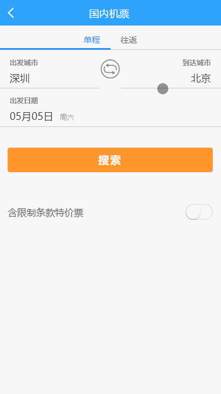

## 介绍

>  本项目基于vue-cli + vuex + mint-ui 封装了城市选择控件

```html
    <v-city
        v-show="showCity"
        :Cdata="Cdata"    //基础城市
        :Hcity="Hcity"    //热门城市
        :Tcity="Tcity">   //目标城市
    </v-city>

```
## 效果


## 项目打包调试步骤


* 安装淘宝镜像
```shell
npm install -g cnpm --registry=https://registry.npm.taobao.org
```

* 安装依赖
```shell
cnpm install
```
* 本地调试
```shell
npm run dev
```

